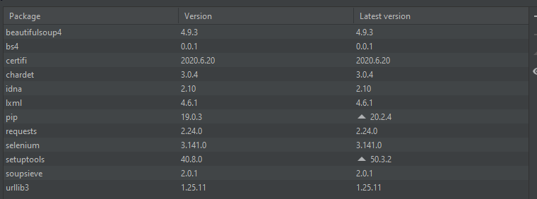

# Herramienta para la extracción de Especificaciones Técnicas de CPUs desde el Año 2000

Esta herramienta es el resultado de una práctica de web scraping para la asignatura Tipología y ciclo de vida de los datos.

En esta práctica se nos ha pedido realizar una herramienta que mediante web scraping, recoja datos de una sitio web y genere un dataset valido. Esta herramienta en concreto recoge los datos de https://www.techpowerup.com/cpu-specs/ y genera un dataset incluyendo toda la información de cada CPU.

## Nota sobre el uso
**El código está escrito en Python3, no es compatible con Python2.**

Una vez descargado el código, main.py y CpuData.py, **debéis incluir en la raíz del proyecto el fichero chromedriver** adecuado para vuestra versión de Chrome y Sistema Operativo.

En cuanto a dependencias las librerías utilizadas han sido:

* **BeautifulSoup**: pip install beautifulsoup4
* **Selenium**: pip install beautifulsoup
* **Urllib3**: pip install urllib3

En nuestro IDE (PyCharm) las opciones concretas del inteprete son las siguientes:

## Opciones de la herramienta
La herramienta detectara de forma automática vuestro sistema operativo, una vez detectado os preguntara por las siguientes opciones:

1. **Default path ("D") or custom:** Si no se pasa ningún valor, o se le pasa el parámetro "D" el dataset se generará como dataset.csv en la raíz del proyecto. Si se le especifica otra ruta valida el dataset se generará en la ruta proporcionada.
2. **Img as path in dataset ("Y") or as BS4 ("N") (BS4 could lead to broken lines in dataset):** Por defecto, o pasando el valor "Y", en el dataset las imágenes aparecerán como una ruta hacía ./img/ sí se pasa el valor "N", en el dataset aparecerán las imágenes codificadas en base64, pero esta opción hará que las líneas del dataset queden rotas, ocupando cada fila más de una línea y deberán ser preprocesados antes de poder utilizarse.
3. **Generate images ("Y"/"N"):** Con la opción por defecto o "Y", las imágenes se descargarán en la máquina, con "N", las imágenes no serán descargadas a la máquina.
4. **Include headers ("Y"/"N"):** Con la opción por defecto o "Y", se añadirán cabeceras al dataset, con "N", no se añadirán las cabeceras.
5. **As default dataset will contain all the loaded years, if you prefer to pick just some years write them separated by coma for example (2010,2011,2012):** Por defecto se descargarán todas las CPU's disponibles desde el año 2000 a la actualidad, pasando un grupo de años separados por coma se pueden seleccionar años concretos, también es posible seleccionar un solo año.

## Dataset generado

El dataset con todos los años puede tardar varios días en generarse, esto es debido a los tiempos de espera que dejamos entre petición y petición para no saturar los servidores de la web, podéis encontrar una versión completa publicada aquí: https://zenodo.org/record/4249728#.X6kJblCCGUk

Este dataset esta generado con una versión de la herramienta que no es la versión final del repositorio, esto se debe a que generar el dataset completo conlleva varios días de procesado y la práctica debía estar lista para la fecha 09/11/2020, aun así, es una versión muy completa que incluye todas las CPU's disponibles en site a día 02/11/2020 y a las que solo les falta, en algunos registros, el campo "Chipset".
